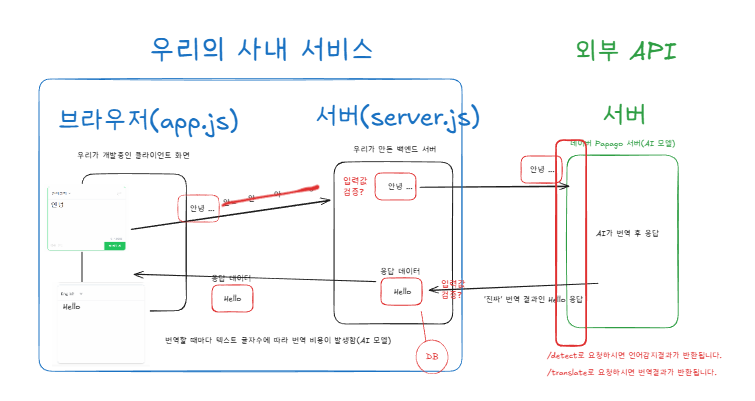
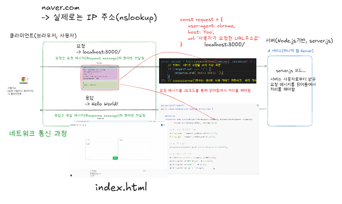
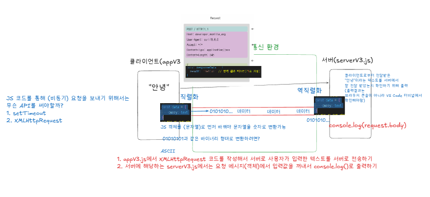

> #  **20251216**

[](./20251215.md) [](./20251216.md) [](./20251217.md) [](./20251218.md) [](./20251219.md)

### 📝 **Goals / Plan**

- [x] 메모 정리 잘 해보자
- [x] 동기사랑 나라사랑 스터디 👍🏻👍🏻
- [x] 🚨 매일 TIL 작성하기 🚨

---

👉 오늘은 'Papago API 연동하기'를 만들어 볼 것이다, <br>
중요한 것은 외부 API (네이버 Papago)를 활용하여 변역기능을 실행해 볼 것이다. <br>
그를 위해서 외부 API와 데이터를 주고 받을 우리가 사용할 서버를 만들어 보고 실행해 봤다.

머리에서 쥐가 나는 것 같았지만 어찌저찌 따라간게 용했다. <br>
터미널을 사용하는 순간 진짜 울면서 뛰쳐나가고 싶었지만 신기하게도 나는 아직 자리에 앉아있네 ^^? <br>
뭐가 뭔지 모르는데 오류는 뜨지 뭐가 막 잘 안 되지 <br>
오류가 안 떠도 이게 맞나 싶고 잘하고 있는지 스스로 판단을 할 수가 없어서 <br>
계속 어버버 거리면서 허둥지둥 시간이 흘렀던 것 같다..

그래도 네트워크 통신 과정과 개념 자체와 큰 흐름에 대해 이해하는 것에 중요도를 많이 두셔서 <br>
같은 얘기도 반복해서 해주시고 한 명 한 명 전부 이해시키고 넘어가겠다는 강사님의 의지가 느껴져서 너무 감사했다..!


<br>

또 수업 끝나고 동기사랑 나라사랑 스터디에서 나의 요정님들의 도움으로 확실히 개념의 대해 이해도가 상승되는 것을 느꼈다..! <br>
이렇게 또 개념에 대해 조금씩 이해도가 올라가는 것이 무챡 신기한 것 같다ㅠㅠ!! 허허헛


<br>

> [!NOTE]
>
> ➡️ 터미널에서는 Git Bash(기본값으로 설정)를 기반으로 한다.
>
> ➡️ 실제 사용자나 브라우저를 **'클라이언트'** 라고 한다. <br>
> ➡️ 클라이언트 - 서버의 통신이라는 개념, 통신 방식(프로토콜) HTTP/HTTPS이다.
>
> 
>
> ➡️ 콜백함수는 요청메세지와 응답메세지가 있는데 객체의 형태로 JSON에다 담아 전송한다.
>
> - **request** 요청메세지
> - **response** 응답메세지
>
> ---
>
> ### ☑ **오늘의 개념 정리**
>
> <br>
>
> 1️⃣ **라이브러리(Library)** <br>
> : 필요할 때 내가 가져다 쓰는 도구 모음 (필요할 때 내가 불러서 쓴다)
>
> - jQuery → DOM 조작 도와주는 도구
> - Lodash → 배열, 객체 처리 유틸 함수 모음
> - Axios → HTTP 요청 도구
> - React (엄밀히는 라이브러리로 분류)
>
> 2️⃣ **프레임워크(Framework)** <br>
> : 프로그램의 뼈대 + 규칙을 제공하는 틀 (정해진 규칙 안에서 불려서 사용된다)
>
> - 애플리케이션의 전체 구조를 이미 정해 둠
> - 그 구조 안에서 내가 코드를 끼워 넣는 방식
> - 프레임워크가 나를 호출함
>
> - Vue
> - Next.js
> - Spring
> - Django
>
> | 구분              | 라이브러리     | 프레임워크         |
> | ----------------- | -------------- | ------------------ |
> | 누가 흐름을 제어? | 👩‍💻 개발자      | 🏗 프레임워크       |
> | 코드 호출         | 내가 직접 호출 | 프레임워크가 호출  |
> | 자유도            | 높음           | 낮음 (대신 안정적) |
> | 구조              | 없음 / 자유    | 정해져 있음        |
> | 학습 난이도       | 비교적 낮음    | 비교적 높음        |
>
> ---
>
> ⏩ 그래서? **Node.js는 라이브러리냐? 프레임워크냐?**
>
> ➡ Node.js는 **프레임워크도 ❌, 라이브러리도 ❌**
>
> ➡ **자바스크립트 런타임 환경(Runtime Environment)** 이다. <br>
> : 브라우저 밖에서도 JavaScript를 실행할 수 있게 해주는 환경
>
> 원래 JS는 크롬, 사파리 같은 브라우저 안에서만 실행됐는데 <br>
> Node.js는 V8 엔진 + 시스템 기능(File, Network 등)을 묶어서 **서버·로컬 PC에서 JS를 실행** 하게 해줌 <br> > **Node.js = 자바스크립트 실행기 + 서버 기능**
>
> ```scss
> [ OS ]
>   ↓
> [ Node.js (런타임) ]
>   ↓
> [ 프레임워크 / 라이브러리 ]
>   - Express (프레임워크)
>   - NestJS (프레임워크)
>   - Axios (라이브러리)
>   - Sequelize (라이브러리/ORM)
> ```
>
> ➡️ 결론은 Node.js 위에서 프레임워크 & 라이브러리가 동작한다.
>
> ---
>
> 3️⃣ **GUI (Graphical User Interface)**
>
> - 컴퓨터를 눈으로 보고, 마우스나 터치로 조작하게 해주는 방식
> - 그래픽 요소(버튼, 아이콘 등)를 통해 사용자가 직관적(보이는 요소)으로 조작할 수 있게 만든 인터페이스
>
> - 우리가 평소에 쓰는 대부분의 화면이 GUI.
> - 프론트엔드 개발자는 : 사용자가 보는 GUI를 만드는 사람.
>
> ➡️ HTML / CSS / JS는 **웹 GUI를 만드는 도구**
>
> ---
>
> 4️⃣ **CLI (Command Line Interface)**
>
> - 명령어(텍스트)를 입력해서 컴퓨터를 조작하는 방식
> - 키보드로 명령어를 직접 입력
>
> ➡ 터미널, 콘솔, Git Bash에서 쓰는 그 화면이 바로 CLI.
>
> - 실제 서버 환경 = CLI만 있는 경우가 많음
> - AWS, Linux 서버 전부 CLI 중심
>
> 🔽 **프론트엔드에서 CLI**는 어디에 쓰일까?
>
> - npm install
> - npm start
> - git clone
> - git commit
> - git push
> - vite create
> - create-react-app
>
> ⏩ **GUI = 🚪 자동문** ➡ 그냥 지나가면 됨 <br>
> ⏩ **CLI = 🔑 비밀번호 입력** ➡ 정확해야 하지만 빠르고 강력
>
> | 구분        | GUI          | CLI                  |
> | ----------- | ------------ | -------------------- |
> | 조작 방식   | 클릭 / 터치  | 명령어 입력          |
> | 사용 난이도 | 쉬움         | 익숙해지면 빠름      |
> | 시각적      | O            | X                    |
> | 화면        | 그래픽       | 텍스트               |
> | 진입 장벽   | 낮음         | 처음엔 어려움        |
> | 속도        | 느릴 수 있음 | 익숙해지면 매우 빠름 |
> | 자동화      | 어려움       | 매우 강함            |
> | 예시        | 윈도우, 웹   | 터미널, Git Bash     |
